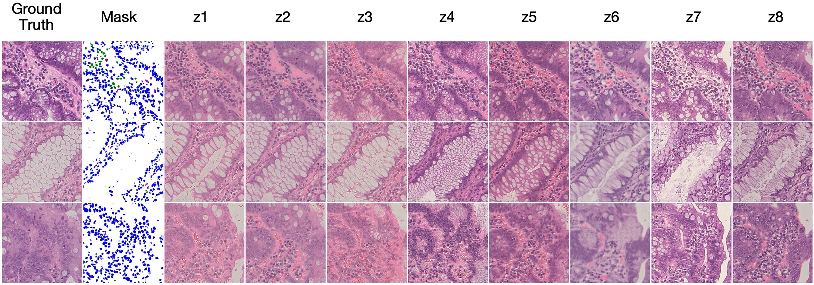

## StyleGAN2-UNet
A style-based GAN with UNet-guided synthesis.

Some examples after training on the [UniToPatho](https://github.com/EIDOSLAB/UNITOPATHO) dataset:



https://user-images.githubusercontent.com/20824840/198903666-7a130b1d-4bc3-49d5-8f41-e964515b2adb.mp4

## Training new networks
### Data preparation
The training requires two image datasets: one for the real images and one for the segmentation masks. The names of the images and masks must be paired together in a lexicographical order.

### Training
To train a network (or resume training), you must specify the path to the segmentation masks through the `seg_data` option and additionally provide the RGB colors for each class through the `seg_colors` option encoded in JSON format.

Example:
```bash
python3 train.py \
  --resume=$HOME/training-runs/00000-train-auto1-resumecustom/network-snapshot-001000.pkl \
  --outdir=$HOME/training-runs \
  --data=$HOME/datasets/crops2-512-filtered/train \
  --seg_data=$HOME/datasets/segmented-512-filtered/train \
  --seg_colors="[[0,0,255],[0,128,0],[0,191,191],[191,0,191],[255,0,0],[255,255,255]]" \
  --image_snapshot_ticks=1 \
  --wandb_project=sgunet \
  --snap=50 \
  --batch=16 \
  --batch_gpu=4 \
  --gpus=1
```

Please refer to [`python train.py --help`](./docs/train-help.txt) for the full list.

## Inference Server
You can spin up an API server that can be used for inference. Refer to [srv.py](./srv.py) for more details.

Example usage:
```bash
export SG_SEG_DATASET_PATH="$HOME/datasets/segmented-512-filtered/train"
export SG_REAL_DATASET_PATH="$HOME/datasets/crops2-512-filtered/train"
export SG_MODEL_PATH="$HOME/training-runs/00000-train-auto1-resumecustom/network-snapshot-001000.pkl"
export SG_SEG_COLORS_JSON="[[0,0,255],[0,128,0],[0,191,191],[191,0,191],[255,0,0],[255,255,255]]"
FLASK_APP=srv.py python -m flask run --host=0.0.0.0
```

## Acknowledgements

This work was supported by [EIDOSLab](https://github.com/EIDOSlab). The code is heavily based on [StyleGAN2-ada-pytorch](https://github.com/NVlabs/stylegan2-ada-pytorch).
